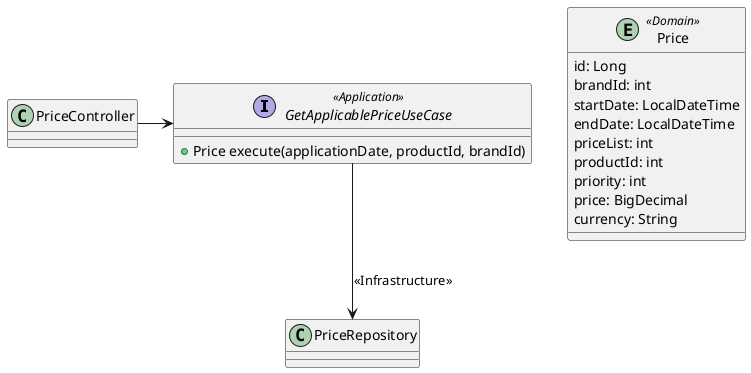

# Applicable Price Service

## Descripción
El servicio **Applicable Price** permite consultar el precio aplicable a un producto específico en función de una fecha dada, una marca (cadena) y las prioridades configuradas. Está construido utilizando una **arquitectura hexagonal**, siguiendo principios de **Clean Code**, y soportado por tecnologías como **Spring Boot**, **Flyway**, **MapStruct**, y **Swagger/OpenAPI**.

---

## Funcionalidades Principales

- **Consulta de precios aplicables:** Devuelve el precio con mayor prioridad dentro del rango de fechas configurado.
- **Gestión eficiente de excepciones:** Manejador global de excepciones para capturar errores y devolver respuestas claras al cliente.
- **Documentación interactiva:** Integración de **Swagger** para visualizar y probar los endpoints disponibles.
- **Pruebas unitarias y de integración:** Validación del comportamiento esperado para casos felices y excepcionales.

---

## Tecnologías Utilizadas

### **Backend**
- **Java 17**: Lenguaje de programación utilizado para la implementación.
- **Spring Boot 3.x**: Framework principal para construir el servicio.
- **Flyway**: Herramienta de migración para la gestión del esquema de la base de datos.
- **MapStruct**: Generador de mapeadores para convertir entidades en objetos de transferencia (DTOs).
- **H2 Database**: Base de datos en memoria para pruebas y desarrollo.
- **Swagger/OpenAPI 3**: Documentación y visualización de endpoints.
- **Arquitectura Hexagonal**: Separación de responsabilidades en capas (Dominio, Aplicación, Infraestructura).

### **Testing**
- **JUnit 5**: Framework para pruebas unitarias.
- **Mockito**: Framework para simulación de dependencias.
- **MockMvc**: Pruebas de integración de controladores.
- **JaCoCo**: Análisis de cobertura de código.

---

## Integración con Swagger y OpenAPI

Swagger y OpenAPI se utilizan para generar documentación interactiva de los endpoints del servicio. Esto permite visualizar, probar y validar las rutas expuestas sin necesidad de herramientas externas.

### Configuración
- **Dependencia Maven:**
  ```xml
  <dependency>
      <groupId>org.springdoc</groupId>
      <artifactId>springdoc-openapi-starter-webmvc-ui</artifactId>
      <version>2.1.0</version>
  </dependency>
  ```

- **Acceso a Swagger UI:**
  Una vez que el servicio esté en ejecución, puedes acceder a Swagger UI en:
  ```
  http://localhost:8080/swagger-ui/index.html
  ```

### Ejemplo de OpenAPI Annotation en un Endpoint
```java
@Operation(
    summary = "Consulta el precio aplicable",
    description = "Devuelve el precio aplicable a un producto basado en la fecha, producto y marca especificados."
)
@ApiResponses(value = {
    @ApiResponse(responseCode = "200", description = "Precio encontrado"),
    @ApiResponse(responseCode = "404", description = "Precio no encontrado"),
    @ApiResponse(responseCode = "400", description = "Solicitud inválida")
})
@GetMapping("/api/prices")
public ResponseEntity<Price> getPrice(
    @RequestParam @DateTimeFormat(pattern = "yyyy-MM-dd HH:mm:ss") LocalDateTime applicationDate,
    @RequestParam int productId,
    @RequestParam int brandId
) {
    Price price = getApplicablePriceUseCase.execute(applicationDate, productId, brandId);
    return ResponseEntity.ok(price);
}
```

---

## Arquitectura

El servicio sigue una **arquitectura hexagonal**, dividiendo las responsabilidades en las siguientes capas:

### **1. Dominio**
- Contiene las reglas de negocio y las entidades principales.
- Ejemplo: `Price`, que representa el precio aplicable.

### **2. Aplicación**
- Define los **casos de uso** que implementan la lógica de negocio.
- Ejemplo: `GetApplicablePriceUseCase`.

### **3. Infraestructura**
- Proporciona las implementaciones de acceso a datos, mapeadores, y migraciones.
- Ejemplo: `PriceRepository` para la consulta de precios en la base de datos.

---

## Diagrama de Arquitectura



---

## Migración de Base de Datos con Flyway

Flyway se utiliza para gestionar el esquema y los datos iniciales de la base de datos. Las migraciones se encuentran en `src/main/resources/db/migration`.

### Ejemplo de Migración Inicial (`V1__create_tables_price_entity.sql`)
```sql
CREATE TABLE PRICES (
    ID BIGINT AUTO_INCREMENT PRIMARY KEY,
    BRAND_ID INT NOT NULL,
    START_DATE TIMESTAMP NOT NULL,
    END_DATE TIMESTAMP NOT NULL,
    PRICE_LIST INT NOT NULL,
    PRODUCT_ID INT NOT NULL,
    PRIORITY INT NOT NULL,
    PRICE DECIMAL(10, 2) NOT NULL,
    CURR VARCHAR(3) NOT NULL
);

INSERT INTO PRICES (BRAND_ID, START_DATE, END_DATE, PRICE_LIST, PRODUCT_ID, PRIORITY, PRICE, CURR)
VALUES
    (1, '2020-06-14 00:00:00', '2020-12-31 23:59:59', 1, 35455, 0, 35.50, 'EUR'),
    (1, '2020-06-14 15:00:00', '2020-06-14 18:30:00', 2, 35455, 1, 25.45, 'EUR'),
    (1, '2020-06-15 00:00:00', '2020-06-15 11:00:00', 3, 35455, 1, 30.50, 'EUR'),
    (1, '2020-06-15 16:00:00', '2020-12-31 23:59:59', 4, 35455, 1, 38.95, 'EUR');
```

---

## Endpoints

### **Consulta de Precios**
- **URL:** `/api/prices`
- **Método:** `GET`
- **Parámetros:**
    - `applicationDate` (obligatorio): Fecha y hora de aplicación.
    - `productId` (obligatorio): Identificador del producto.
    - `brandId` (obligatorio): Identificador de la marca (cadena).
- **Respuesta Exitosa (`200 OK`):**
  ```json
  {
    "id": 1,
    "brandId": 1,
    "startDate": "2020-06-14T00:00:00",
    "endDate": "2020-12-31T23:59:59",
    "price": 35.50
  }
  ```
- **Errores:**
    - `404 Not Found`: Si no se encuentra un precio aplicable.
    - `400 Bad Request`: Si los parámetros son inválidos.

---

## Pruebas

### **Pruebas Unitarias**
Se cubren los siguientes casos:
- Selección del precio basado en prioridad.
- Gestión de excepciones como `PriceNotFoundException`.

### **Pruebas de Integración**
Se realizan con `MockMvc` para validar el endpoint y la interacción con la base de datos.

---

## Cómo Ejecutar el Proyecto

### **Requisitos**
- Java 17 o superior.
- Maven 3.x.

### **Pasos para Ejecutar**
1. Clona el repositorio:
   ```bash
   git clone https://github.com/marianogodoy82/price-rest.git
   ```
2. Ve al directorio del proyecto:
   ```bash
   cd price-rest
   ```
3. Ejecuta las migraciones y el servicio:
   ```bash
   mvn spring-boot:run
   ```
4. Accede a la documentación Swagger en: `http://localhost:8080/swagger-ui/index.html`.
5. Consulta el endpoint principal en: `http://localhost:8080/api/prices`.

---

## Análisis de Cobertura

**Jacoco** se utiliza para analizar la cobertura de código. Ejecuta el siguiente comando para generar el informe:

```bash
mvn clean verify
```

El informe estará disponible en `target/site/jacoco/index.html`.

---

## Mejores Prácticas Aplicadas

1. **Clean Code:** Código fácil de leer y mantener.
2. **Hexagonal Architecture:** Separación clara entre dominio, casos de uso e infraestructura.
3. **Pruebas:** Cobertura completa con casos felices y excepcionales.
4. **Gestión de Migraciones:** Flyway asegura consistencia en la base de datos.
5. **Documentación:** Swagger/OpenAPI proporciona documentación interactiva y fácil de usar.

---

## Autor
- **Mariano Godoy**
- **GitHub:** [marianogodoy82](https://github.com/marianogodoy82)
